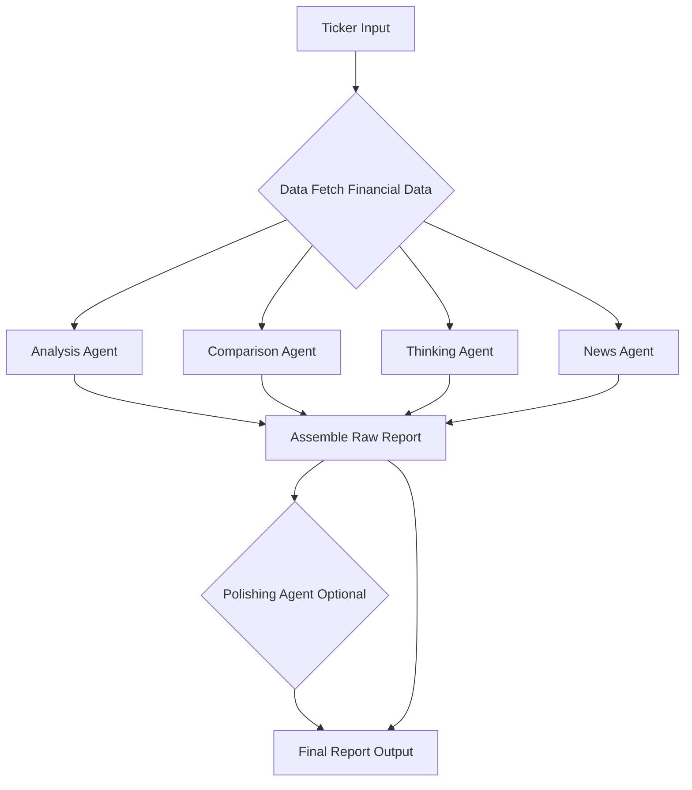

# apex_fin Documentation

## 🎯 Goal

**apex_fin** is an Agentic modular Python toolkit for building advanced financial analysis reports.  
It solves the challenge of transforming raw financial data into actionable, well-structured reports for analysts and business users.

**Key Capabilities:**

- Ingests data from multiple sources (YahooFinance API, web search)
- Extracts, normalizes, and analyzes financial information
- Generates comprehensive, customizable reports (Markdown)
- Supports agentic workflows and LLM-powered reasoning

### Intended Audience

- Financial analysts  
- Data engineers & developers  
- Business intelligence teams

## 🏗️ High-Level Architecture

The report-building pipeline consists of:

1. **Input Sources:** Yahoo Finance APIs
2. **Parsing & Extraction:** Structured data extraction, OCR, LLM-based field parsing
3. **Transformation & Normalization:** Data cleaning, schema mapping, enrichment
4. **Templating & Report Generation:** Modular templates, agent orchestration, LLM-driven sections
5. **Output:** Markdown, JSON, PDF, or custom formats

## 📋 Command Line Interface (CLI)

All commands support `--config` for custom YAML, and `--output` for file export.

| Command         | Purpose                                         | Example Usage                                      |
|-----------------|-------------------------------------------------|----------------------------------------------------|
| `analyze`       | Company financial health analysis               | `python -m apex_fin.main analyze AAPL`             |
| `compare`       | Compare company to competitors                  | `python -m apex_fin.main compare MSFT`             |
| `fullreport`    | Full multi-section financial report             | `python -m apex_fin.main fullreport AMZN`          |
| `think`         | Contextual risk & policy reasoning              | `python -m apex_fin.main think GOOGL`              |

(Note: The `teamreport` command is currently experimental and not available in the main CLI.)

**Common Options:**

- `--output, -o`: Write report to file
- `--config, -c`: Use custom YAML config

## 📦 Module Breakdown

| Module / Subpackage         | Purpose / Key Classes & Functions                                   | Integration Points                | API Reference                                                                                                                               |
|-----------------------------|---------------------------------------------------------------------|-----------------------------------|---------------------------------------------------------------------------------------------------------------------------------------------|
| `agents/`                   | Specialized agents for analysis, comparison, reasoning              | Used by CLI and teams             | [agents/index.md](./reference/apex_fin/agents/index.md)                                                                                     |
| &nbsp;&nbsp;`analysis_agent`| [`build_analysis_agent`](./reference/apex_fin/agents/analysis_agent/#build_analysis_agent), core financial analysis | Consumes parsed data              | [analysis_agent.md](./reference/apex_fin/agents/analysis_agent.md)                                                                          |
| &nbsp;&nbsp;`comparison_agent`| [`compare_company`](./reference/apex_fin/agents/comparison_agent/#compare_company), benchmarks vs. competitors | Uses extracted peer data          | [comparison_agent.md](./reference/apex_fin/agents/comparison_agent.md)                                                                      |
| &nbsp;&nbsp;`thinking_agent`| [`build_thinking_agent`](./reference/apex_fin/agents/thinking_agent/#build_thinking_agent), contextual/macro risk analysis | Invoked in `think`/team reports   | [thinking_agent.md](./reference/apex_fin/agents/thinking_agent.md)                                                                          |
| &nbsp;&nbsp;`full_report_agent`| [`build_full_report`](./reference/apex_fin/agents/full_report_agent/#build_full_report), orchestrates sequential report generation | Used by `fullreport` command      | [full_report_agent.md](./reference/apex_fin/agents/full_report_agent.md)                                                                    |
| `models/`                   | Data schemas (e.g., [`ReportSchema`](./reference/apex_fin/models/report_schema/#ReportSchema)) | Shared across agents              | [models/index.md](./reference/apex_fin/models/index.md)                                                                                     |
| `prompts/`                  | Instruction templates for LLMs                                     | Customizable per agent            | [prompts/index.md](./reference/apex_fin/prompts/index.md)                                                                                   |
| `teams/`                    | Multi-agent orchestration, team logic                              | Used by `teamreport` (experimental) | [teams/index.md](./reference/apex_fin/teams/index.md)                                                                                       |
| `config.py`                 | Loads `.env` and YAML config, merges settings ([`MergedSettings`](./reference/apex_fin/config/#MergedSettings)) | Used globally                     | [config.md](./reference/apex_fin/config.md)                                                                                                 |
| `main.py`                   | Typer CLI, command routing                                         | Entry point                       | [main.md](./reference/apex_fin/main.md)                                                                                                     |

## 🔧 Features & Extensibility

- **Multi-Source Input:** Easily add new data connectors (PDF, API, DB)
- **LLM Integration:** Swap LLM providers (OpenAI, Gemini, Azure) via config
- **Bounding Box/Field Extraction:** Supports OCR and spatial data (if enabled)
- **Config-Driven Pipelines:** Enable/disable agents, customize prompts, set thresholds
- **Templating:** Modular report templates, Markdown or JSON output
- **Internationalization:** Extendable for multi-language support

**How to Extend:**

- **Add Document Types:** Implement new parser in `agents/` and register in CLI
- **Extend Schemas:** Add/modify Pydantic models in `models/`
- **Integrate LLM Providers:** Add new backend in config and agent logic
- **Customize Templates:** Edit or override prompt files in `prompts/`

## Reference

- [API Reference](./api.md)
- [Module Details](./overview.md)
